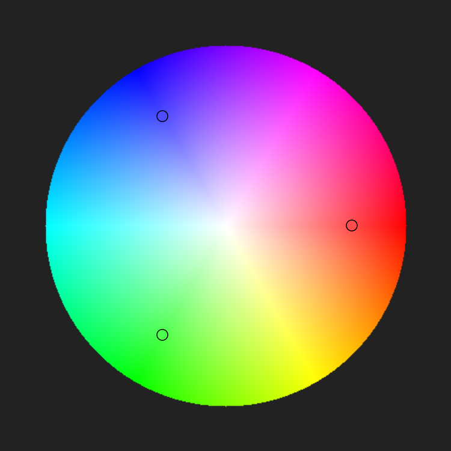

# 🎨 Color Harmony

Цей проект дозволяє візуально досліджувати кольори та їх гармонії за допомогою інтерактивного кольорового круга. Створено з використанням [Konva.js](https://konvajs.org/) для малювання на Canvas.

## 🖼️ Можливості

- Вибір основного кольору на колірному колі
- Візуалізація гармонійних кольорів:
  - тріадних
  - комплементарних
  - аналогових
- Переміщення індикаторів за допомогою миші
- Плавне оновлення кольорів у реальному часі

## ⚙️ Технології

- JavaScript (ES6)
- [Konva.js](https://konvajs.org/) — для роботи з Canvas
- [Chroma.js](https://gka.github.io/chroma.js/) — для обчислення гармонійних кольорів (опціонально)

## 🚀 Запуск

1. Клонувати репозиторій:

```bash
git clone https://github.com/your-username/color-harmony.git
cd color-harmony
```

## Скріншот 


